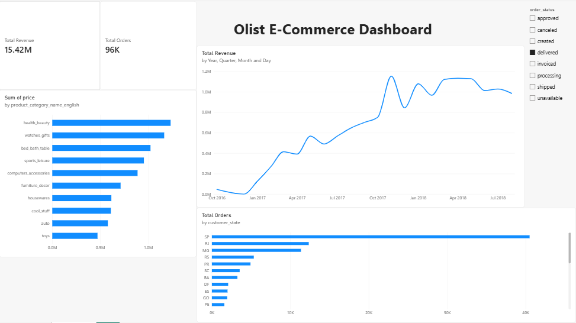
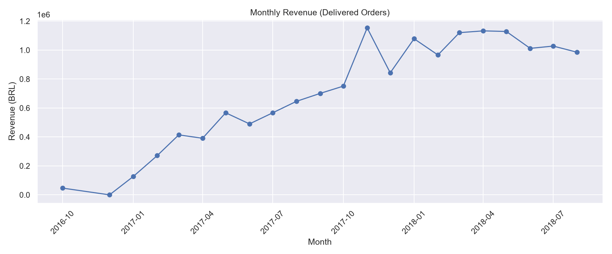

# Olist E-Commerce Analysis

End-to-end analysis of the Brazilian Olist e-commerce dataset using **PostgreSQL, Python and Power BI**.

## Business Questions
- How much revenue and how many orders does Olist generate?
- How does revenue trend month over month?
- Which product categories and states drive sales?
- What share of orders are delivered late?

## Tech Stack
- **PostgreSQL** (Docker) + **DBeaver**: data loading and SQL analysis
- **Python** (pandas, matplotlib, seaborn, SQLAlchemy): EDA and charts
- **Power BI**: interactive dashboard
- **Git / GitHub**: version control

## Project Structure
olist-analysis/
├── sql/          # setup and analysis queries
├── notebooks/    # Jupyter EDA
├── dashboard/    # Power BI file (.pbix)
├── docs/         # charts and screenshots
└── README.md

## Key Findings
- Delivered orders: ~96K, total revenue ~15.4M BRL
- Top categories by sales: health_beauty, watches_gifts, bed_bath_table
- Sao Paulo (SP) is the largest state by orders
- Late deliveries: 8.11% of delivered orders
- Revenue peaked around Nov 2017 (Black Friday)

## Dashboard

## Monthly Revenue

## How to Run
1. Download the dataset from Kaggle: "Brazilian E-Commerce Public Dataset by Olist"
2. Start PostgreSQL: `docker run --name olist-db -e POSTGRES_PASSWORD=admin123 -p 5432:5432 -d postgres`
3. Load the CSVs into schema `olist` (see `sql/01_setup.sql`)
4. Run `sql/02_analysis.sql`, then open `notebooks/01_eda.ipynb`
5. Open `dashboard/olist_dashboard.pbix` in Power BI Desktop

## Author
Aditya Kumar Kanu | GitHub: adityakumarkanu